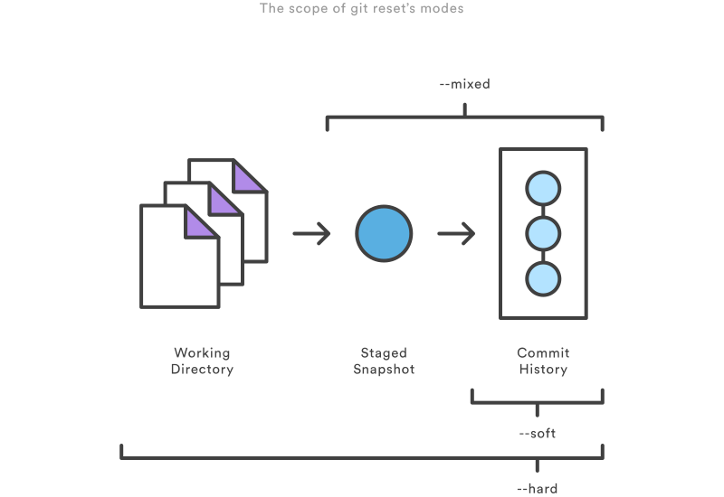

# GIT

GIT quick reference.

# Table of Contents
- [Configuration](#configuration)
- [Clone a repository](#clone-a-repository)
- [Saving changes](#saving-changes)
- [Repository Info](#repository-info)
- [Log](#log)
- [Commit Changes](#commit-changes)
- [Revert Changes](#revert-changes)
- [Send Changes To Remote](#revert-changes)
- [Branches](#branches)
- [Git Simple Workflow](#git-simple-workflow)

<div id='configuration' />
## Configuration

#### Console abort command

To abort a command use `CTRL + C`.

#### Core editor

Install `Notepadd++` and set the core editor.

```
$ git config --global core.editor C:/Utils/Notepad++/notepad++.exe
```

#### Diff and Merge tool

Install `Meld` and edit the `.gitconfig` global file.

```
$ git config --global --edit
```

Add these entries.

```
[diff]
    tool = meld
    guitool = meld
[difftool "meld"]
    path = C:/Utils/Meld/Meld.exe
[difftool]
	prompt = false
[merge]
	tool = meld
[mergetool "meld"]
	path = C:/Utils/Meld/Meld.exe
```

Or execute this lines.

```
$ git config --global diff.tool "meld"
$ git config --global diff.guitool "meld"
$ git config --global difftool.meld.path "C:/Utils/Meld/Meld.exe"
$ git config --global difftool.prompt false

$ git config --global merge.tool "meld"
$ git config --global mergetool.meld.path "C:/Utils/Meld/Meld.exe"
```

To use this tool.

```
$ git difftool
```

#### Global user details

Display the global user name and email.

```
$ git config --global user.name
$ git config --global user.email
```

Set the local user name and email.

```
$ git config --global user.name "User Name"
$ git config --global user.email "user@email.com"
```

#### Local user details

Display the local user name and email.

```
$ git config user.name
$ git config user.email
```

Set the local user name and email.

```
$ git config user.name "User Name"
$ git config user.email "user@email.com"
```

#### Display the config file

```
$ git config --list
```

```
$ git config --global --list
```

```
$ git config --local --list
```

```
$ cat .git/config
```

<div id='clone-a-repository' />
## Clone a repository

Clone the repository located at <repo> onto the local machine.

```
$ git clone <repo>
```

Clone the repository located at <repo> into the folder called <directory> on the local machine.

```
$ git clone <repo> <directory>
```

<div id='saving-changes' />
## Saving changes

Stage all changes in <file> for the next commit.

```
git add <file>
```

Stage all changes in <directory> for the next commit.

```
git add <directory>
```

Stage all changes for the next commit.

```
$ git add .
```

<div id='repository-info' />
## Repository Info

View the state of the working directory and the staging area.

```
$ git status
```

Show changes between commits, commit and working tree, etc.

```
$ git diff
```

List the existing branches.

```
$ git branch
```

<div id='log' />
## Log

```
$ git log
```

It groups each commit by author and displays the first line of each commit message.

```
$ git shortlog
```

Display only the commit ID and the first line of the commit message.

```
$ git log --oneline
```

Display all of the references (e.g., branches, tags, etc) that point to each commit.

```
$ git log --oneline --decorate
```

Display the log of one commit (the newest first).

```
$ git log -1
```

Show the changes for the commits.

```
$ git log -p -1
```

Displays the number of insertions and deletions to each file altered by each commit (note that modifying a line is represented as 1 insertion and 1 deletion).

```
$ git log --stat -1
```

Drawing an ASCII graph representing the branch structure of the commit history.

```
git log --graph --oneline
```

Formatting the log.

```
$ git log --pretty=format:"%h - %an, %ar : %s"
```

Log for an author.

```
$ git log --pretty="%h - %s" --author="User Name"
```

Log since a date.

```
$ git log --since=2.weeks
$ git log --pretty="%h - %s" --since="2016-01-01"
```

<div id='commit-changes' />
## Commit Changes

Apply the staged changes with the command `add` with a description message.

```
$ git commit -m "first commit"
```

<div id='revert-changes' />
## Revert Changes

#### Reset

Revert is a way to move the tip of a branch to a different commit. This can be used to remove commits from the current branch. It can have the following flags.

1. `--soft` – The staged snapshot and working directory are not altered in any way.
2. `--mixed` – The staged snapshot is updated to match the specified commit, but the working directory is not affected. This is the default option.
3. `--hard` – The staged snapshot and the working directory are both updated to match the specified commit.



```
$ git reset --hard
```

#### Clean

Remove untracked files (e.g., new files, generated files).

```
$ git clean -f
```

Remove untracked directories (e.g., new or automatically generated directories).

```
$ git clean -fd
```

<div id='send-changes-to-remote' />
## Send Changes To Remote

```
$ git push origin master
```

<div id='branches' />
## Branches

### Create

```
$ git branch branch-name
```

### Switch to

```
$ git checkout branch-name
```

### Create and switch to

```
$ git checkout -b branch-name
```

<div id='git-simple-workflow' />
## Simple GIT workflow

```
$ git pull
    get all the changes from the remote repository
```
```
$ git checkout -b branch-name
    create a new branch to work in
```
```
$ git status
    see the changes
```
```
$ git diff
    see the differences in detail
```
```
$ git add .
    add all the changes to be committed
```
```
$ git commit -m "message"
    make the commit with a description message
```
```
$ git checkout master
    switch back to the master branch
```
```
$ git merge branch-name
    update the master branch with the branch-name work
```
```
$ git push origin master
    send the changes to the remote repository
```